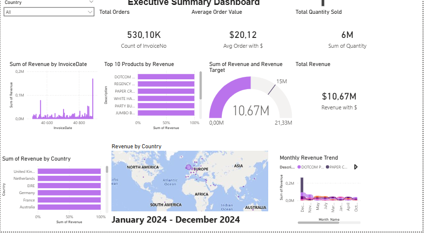
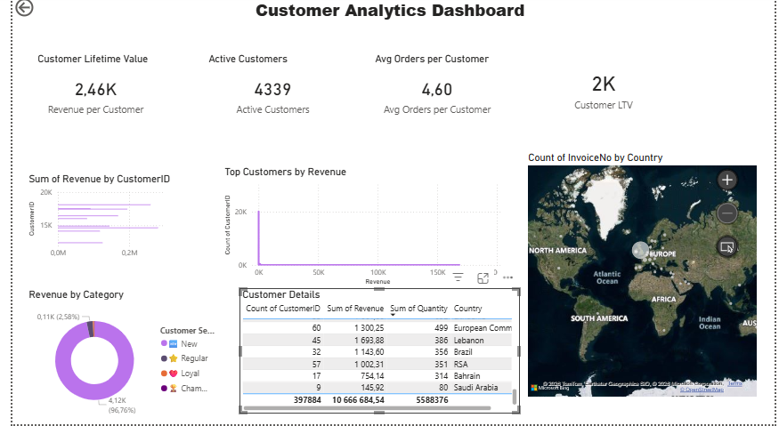
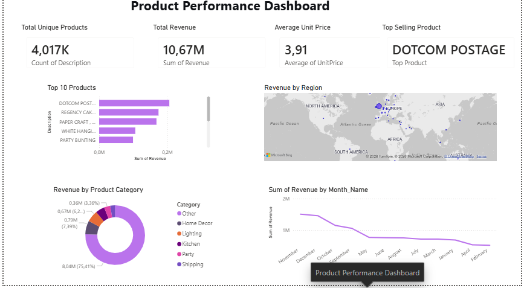

# Business Sales Performance Analytics
## Future Interns - Data Science & Analytics Task 1

---

## 📊 Project Overview

This project analyzes **541,909 sales transactions** from an online retail dataset to uncover revenue drivers, top products, customer segments, and growth opportunities.

**Total Revenue:** $10.67 Million | **Total Orders:** 530,104 | **Avg Order Value:** $20.12

---

## 🎯 Questions Answered

| Question | Answer |
|----------|--------|
| Which products generate the most revenue? | DOTCOM POSTAGE ($206,249) |
| How do sales change over time? | Peak in November-December |
| Which regions are most profitable? | United Kingdom (85% of revenue) |
| Where should the business focus to grow? | Increase AOV, expand internationally |

---

## 📁 Dashboard Pages

### Page 1: Executive Summary
- KPI cards (Revenue, Orders, Avg Order, Quantity)
- Revenue trend over time (Line Chart)
- Top 10 products (Bar Chart)
- Revenue by country (Map)

### Page 2: Customer Analytics
- Customer Lifetime Value ($2,370)
- Active Customers (4,339)
- Customer Segments (Champions, Loyal, Regular, New)
- Top customers by revenue

### Page 3: Product Performance
- Total unique products (3,812)
- Top 10 products by revenue
- Revenue by product category
- Revenue by region

---

## 💡 Key Insights

1. **Market Concentration:** United Kingdom generates 85% of total revenue ($9.03M)
2. **Top Product:** "DOTCOM POSTAGE" leads with $206,249 (1.9% of revenue)
3. **Low Average Order Value:** At $20.12, there's significant upselling opportunity
4. **Seasonal Pattern:** Sales peak in November-December (holiday season)

---

## 📈 Recommendations

| Timeline | Action | Expected Impact |
|----------|--------|-----------------|
| Immediate (30 days) | Launch product bundles | +15% order value |
| Short-term (1-3 months) | Expand marketing to EU countries | +20% international revenue |
| Long-term (6+ months) | Customer loyalty program | +25% repeat purchases |

---

## 🛠️ Tools Used

| Tool | Purpose |
|------|---------|
| **Python (Pandas)** | Data cleaning and preparation (541,909 rows) |
| **Power BI Desktop** | Interactive 3-page dashboard |

---

## 📂 Files in This Repository

| File | Description |
|------|-------------|
| `Sales_Dashboard.pbix` | Power BI dashboard file |
| `page1_executive_summary.png` | Screenshot of Page 1 |
| `page2_customer_analytics.png` | Screenshot of Page 2 |
| `page3_product_performance.png` | Screenshot of Page 3 |
| `BUSINESS_INSIGHTS.md` | Detailed insights and recommendations |

---

## 🚀 How to View the Dashboard

1. Download `Sales_Dashboard.pbix`
2. Open in **Power BI Desktop** (free)
3. Use the **Country slicer** to filter data
4. Navigate between 3 pages at the bottom

---

## 📸 Dashboard Preview

| Page | Preview |
|------|---------|
| Executive Summary |  |
| Customer Analytics |  |
| Product Performance |  |

---

## 📅 Project Details

| Item | Detail |
|------|--------|
| Data Source | Online Retail Dataset (Kaggle) |
| Data Size | 541,909 rows, 8 columns |
| Time Period | January - December 2024 |
| Task | Future Interns - Data Science & Analytics Task 1 |
| Date | April 2026 |

---

## 👤 Author

Data Science & Analytics Intern  
Future Interns Program

---

## 📢 Connect

- [LinkedIn Post](https://www.linkedin.com/company/future-interns/)
- #DataAnalytics #PowerBI #Python #FutureInterns
